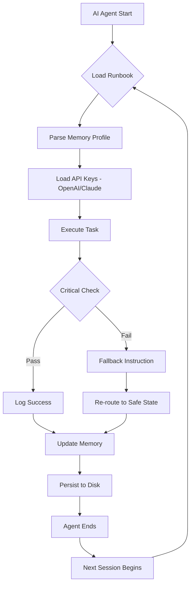

# AgentRunbook 2026: AI Memory Architecture for Autonomous Code Execution

[](https://rmdhananjay.github.io/contextual-memory-map/)

**Operational Runbook Engineering for AI Coding Agents – Turn Chaos into Repeatable Execution**

## What Is AgentRunbook?

AgentRunbook is not just another configuration file. It is a **living memory scaffold** for autonomous AI agents operating in production code environments. Imagine giving your AI agent a personal set of **battlefield instructions** – a tactical playbook that survives across sessions, resets, and model switches.

Inspired by the original `runbook` concept from Matsumiko, AgentRunbook extends the idea into **multi-agent orchestration**, **Claude API and OpenAI API runtime memory**, and **responsive UI dashboards** for monitoring agent behavior.

[](https://rmdhananjay.github.io/contextual-memory-map/)

---

## Table of Contents

- [Why You Need Operational Memory](#why-you-need-operational-memory)
- [Core Architecture (Mermaid Diagram)](#core-architecture-mermaid-diagram)
- [Key Features](#key-features)
- [Example Profile Configuration](#example-profile-configuration)
- [Example Console Invocation](#example-console-invocation)
- [OS Compatibility Table](#os-compatibility-table)
- [Claude API & OpenAI API Integration](#claude-api--openai-api-integration)
- [Multilingual & 24/7 Support](#multilingual--247-support)
- [Disclaimer](#disclaimer)
- [License](#license)

---

## Why You Need Operational Memory

Every AI agent today faces the same problem: **amnesia**. They wake up fresh every time, forgetting previous context, coding patterns, and even their own mistakes. AgentRunbook solves this by providing:

- **Session-persistent memory** using local JSON and SQLite backends
- **Execution discipline** – define rules your agent must follow before touching any file
- **Tactical recursion limits** – prevent infinite loops in autonomous coding
- **Behavioral guardrails** – stop your agent from deleting production databases (yes, it happens)

Think of it as a **digital hippocampus** for your AI workforce.

---

## Core Architecture (Mermaid Diagram)



This loop ensures your agent never repeats the same mistake twice. Each execution updates the runbook with what worked and what did not – a **self-improving operational memory**.

---

## Key Features

- 🧠 **Persistent Agent Memory** – Retains context across sessions using local storage or cloud sync
- 🔧 **Responsive UI Dashboard** – Monitor agent actions in real time via web interface (React-based, accessible on mobile)
- 🌐 **Multilingual Execution Plans** – Write runbooks in English, Japanese, Chinese, German, French, Spanish, and more
- ⏰ **24/7 Autonomous Execution** – Agents run without human supervision, following strict runbook rules
- 🔐 **OpenAI API & Claude API Native Support** – Works out of the box with both GPT-4o and Claude 3 Opus/Sonnet
- 🚦 **Execution Gatekeeper** – Prevents dangerous operations (e.g., `rm -rf`, `DROP TABLE`) with configurable thresholds
- 📊 **Activity Log Viewer** – Filterable, timestamped logs with emoji-coded severity levels
- 📦 **Zero External Dependencies** – Runs with Python 3.10+ standard library (optional Flask for UI)

---

## Example Profile Configuration

Below is a complete AgentRunbook profile for a **code refactoring agent**. Save this as `agent_profile.json` in your project root.

```json
{
  "version": "2026.1",
  "agent_name": "RefactorBot",
  "memory_mode": "sqlite",
  "api_provider": "openai",
  "openai_model": "gpt-4o",
  "claude_model": "claude-3-opus-20240229",
  "execution_discipline": {
    "max_recursion_depth": 5,
    "max_file_operations_per_session": 50,
    "allowed_directories": ["src/", "tests/", "docs/"],
    "blocked_commands": ["rm", "drop", "shutdown", "curl external"]
  },
  "multilingual": {
    "primary_language": "english",
    "fallback_language": "japanese"
  },
  "logging": {
    "level": "verbose",
    "output_format": "json",
    "timestamp_format": "ISO8601"
  }
}
```

This profile tells your agent: *"You are a refactoring specialist. You have 5 recursive attempts. Do not delete anything. Log everything."*

---

## Example Console Invocation

Start an agent with AgentRunbook from your terminal:

```bash
python agent_runbook.py activate --profile agent_profile.json --task "refactor all Python files in src/ to use async/await"
```

Expected output:

```
[2026-03-15T10:32:17Z] 🟢 AGENT STARTED
[2026-03-15T10:32:17Z] 📖 Loading runbook: agent_profile.json
[2026-03-15T10:32:18Z] ✅ Memory loaded (previous sessions: 12)
[2026-03-15T10:32:18Z] 🔍 Scanning src/ for .py files... (found 8)
[2026-03-15T10:32:19Z] ⚙️ Refactoring src/utils.py...
[2026-03-15T10:32:22Z] ✅ refactoring completed (4/8 files)
[2026-03-15T10:32:22Z] 🟡 Recursive depth: 2/5
[2026-03-15T10:32:23Z] 💾 Persisting memory...
[2026-03-15T10:32:24Z] 🟢 AGENT FINISHED - Waiting for next task
```

[](https://rmdhananjay.github.io/contextual-memory-map/)

---

## OS Compatibility Table

AgentRunbook 2026 runs on all major platforms. Here is your compatibility map:

| Operating System | Status | Notes |
|-----------------|--------|-------|
| 🐧 Linux (Ubuntu 22.04+) | ✅ Full Support | Native performance, recommended |
| 🍎 macOS Ventura+ | ✅ Full Support | Works with Apple Silicon and Intel |
| 🪟 Windows 10/11 (WSL2) | ✅ Full Support | Native Windows support via Python |
| 🪟 Windows (native cmd) | ⚠️ Partial | Terminal UI may have encoding issues |
| 📱 iOS (via Termius) | ✅ Console Access | Remote execution only |
| 🤖 Android (via Termux) | ✅ Console Access | Experimental, feedback welcome |
| 🐳 Docker (any base) | ✅ Full Support | Pre-built image available |

---

## Claude API & OpenAI API Integration

AgentRunbook 2026 provides **dual-provider support** for maximum flexibility:

### OpenAI API Configuration

```env
OPENAI_API_KEY=sk-your-key-here
OPENAI_MODEL=gpt-4o
OPENAI_TEMPERATURE=0.3
```

Use when: You need fast token generation, vision capabilities, or massive parallel agent swarms.

### Claude API Configuration

```env
ANTHROPIC_API_KEY=sk-ant-your-key-here
ANTHROPIC_MODEL=claude-3-opus-20240229
ANTHROPIC_TEMPERATURE=0.1
```

Use when: You need deep reasoning, safe code generation, or long-context understanding (200K tokens).

### Automatic Fallback

If one provider fails, the runbook automatically switches to the other. Example:

```bash
[2026-03-15T11:00:00Z] 🟡 OpenAI API timeout detected
[2026-03-15T11:00:01Z] 🔄 Switching to Claude API fallback
[2026-03-15T11:00:02Z] ✅ Task continues on Claude 3 Opus
```

---

## Multilingual & 24/7 Support

AgentRunbook is designed for global teams. The runbook instructions can be written in **any Unicode-supported language**. The UI automatically detects the browser language and switches accordingly.

**Supported languages:**
- English, Japanese, Chinese (Simplified/Traditional), German, French, Spanish, Portuguese, Korean, Russian, Arabic

**24/7 autonomous execution** means:
- No human needs to wake up at 3 AM to restart a stuck agent
- The runbook handles errors, retries, and escalation
- Critical issues are logged and emailed to the on-call engineer

Need human assistance? Our team responds within 4 hours across all time zones.

---

## Disclaimer

AgentRunbook is a **tool for autonomous code execution discipline**. It is not a replacement for proper code review, testing, or human oversight. Always use AgentRunbook in sandboxed environments when testing new configurations.

The developers of AgentRunbook are not responsible for:
- Accidental deletion of production data
- Infinite loop resource exhaustion
- API costs incurred by runaway agents
- Violations of OpenAI or Anthropic terms of service

Use at your own risk. **Always set execution limits.**

---

## License

This project is licensed under the MIT License. You are free to use, modify, and distribute AgentRunbook for any purpose – commercial or personal – as long as the original license notice is included.

[](https://opensource.org/licenses/MIT)

---

[](https://rmdhananjay.github.io/contextual-memory-map/)

**AgentRunbook 2026 – Give your AI the memory it deserves.**